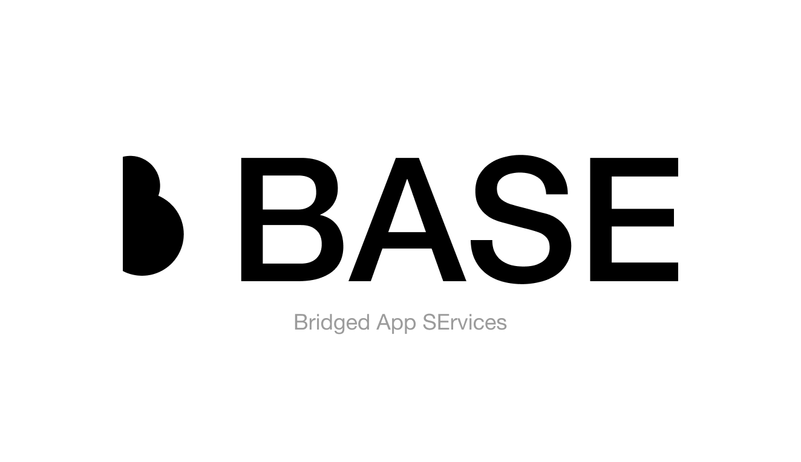

# BASE: Bridged App SErvices - [bridged.cc](https://bridged.cc)

> public services (all services except auth and billing) msa repository


## Are you looking for ready-to-use SDK of this service?

In that case, you are looking for [base-sdk](https://github.com/bridgedxyz/base-sdk)

# development

## micros
- [asset-service](./assets-service)
- [g11n-service](https://github.com/bridgedxyz/g11n)
- resource-hosting
- application hosting
- [cors-service](./cors-service)
- auth (read the development token generation docs)

## packages
- [dartservices](./packages/dartservices)


```shell
# cloning with git submodules
git clone https://github.com/bridgedxyz/services.git --recurse-submodules

# pulling with git submodules (second entry)
git submodule update --init --recursive
```

## Ready to use services
[CORS.BRIDGED.CC](https://cors.bridged.cc)


## running services

> you need serverless framework to be installed on your local machine

```sh
yarn

# replace target-service with actual directory name that you are targetting
cd ./target-service
sls offline
```


## Docs

[bridged msa docs on notion](https://www.notion.so/bridgedxyz/services-msa-d00ff606766d4df09a2ea8dcfa1b0de2)


[bridged msa diagram on figma](https://www.figma.com/file/t5EdSlZo7eyWgXLSqTx7ok/hackers?node-id=0%3A1)


## Frameworks

nestjs - [learn more](https://docs.nestjs.com/microservices/basics)


# usage

> if you are simply lookin for bridged cloud access, this can be done with [client-sdk](https://github.com/bridgedxyz/client-sdk-ts)
## Client usage - Installation

goto https://github.com/bridgedxyz/client-sdk-ts
