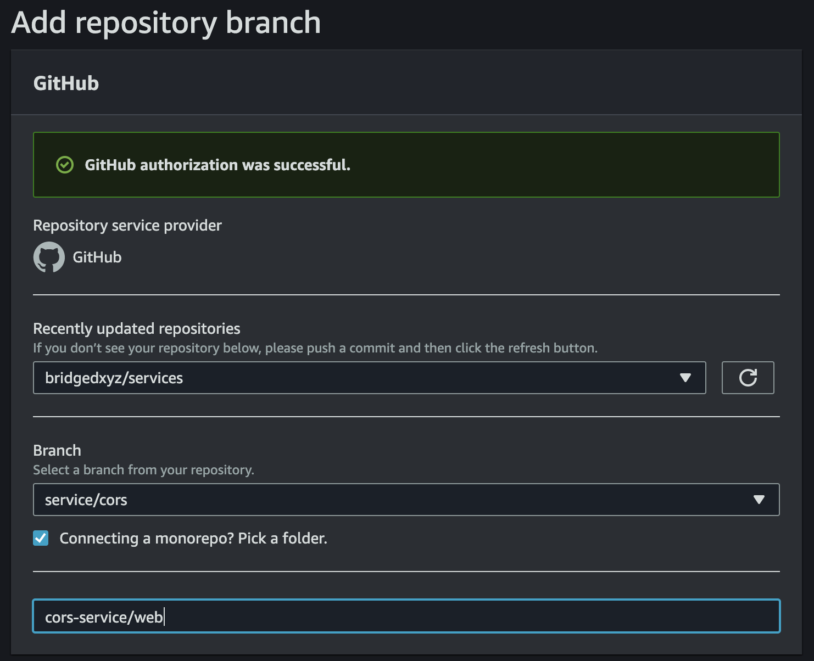

# CORS.BRIDGED.CC


## The Web deployment


The web app gets deployed on branch `service/cors`


**other cd options**
using serverless-finch (dropped & not used)
> this is an obsolete approach of deploying web to s3, which we are no longer using

in serverless.yml
```
custom:
  scripts:
    hooks:
      'before:package:createDeploymentArtifacts': yarn --cwd web build && sls client deploy
  client:
    bucketName: app.cors.bridged.cc
    distributionFolder: web/build
    indexDocument: index.html
    errorDocument: index.html

plugins:
    - serverless-finch
```


```
yarn add --dev serverless-plugin-scripts serverless-finch
```